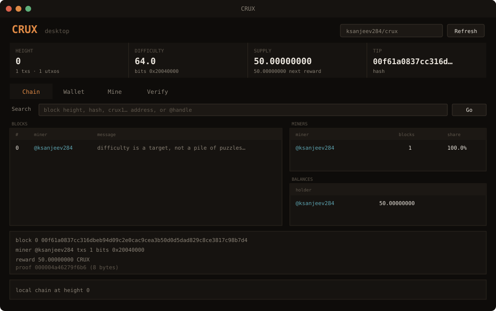

<h1 align="center">CRUX</h1>

<p align="center">
  <em>A Bitcoin-like chain whose canonical ledger is this README.</em><br>
  <sub>Proof of work is one knapsack under a hash target — difficulty can rise forever, the proof stays 8 bytes</sub>
</p>

<p align="center">
  <a href="https://github.com/ksanjeev284/crux/releases/latest"></a>
  <a href="https://github.com/ksanjeev284/crux/actions/workflows/verify.yml"></a>
  
  
  <a href="LICENSE"></a>
</p>

<p align="center">
  <a href="https://ksanjeev284.github.io/crux/"><b>Block explorer</b></a> ·
  <a href="https://github.com/ksanjeev284/crux/releases/latest"><b>Download</b></a> ·
  <a href="#desktop-gui"><b>Desktop GUI</b></a> ·
  <a href="SPEC.md"><b>Consensus spec</b></a> ·
  <a href="SETUP.md"><b>Launch your own</b></a> ·
  <a href="../../actions"><b>Node</b></a>
</p>

---

<!-- CRUX:BEGIN -->

<picture><source media="(prefers-color-scheme: dark)" srcset="assets/ledger-dark.svg?v=177"></picture>

| | |
|---|---|
| **height** | `177` |
| **tip** | `000079957f163159a0a50a1e692fff5e09f70887874a201912b90c5440e5f45b` |
| **difficulty** | `82,927.6`  (bits `0x1f00ca4f`) |
| **chainwork** | `6,229,008` expected hashes |
| **supply** | `8900.00000000 CRUX` in `178` unspent outputs |
| **next reward** | `50.00000000 CRUX` |
| **next retarget** | in `14` block(s) |
| **next halving** | in `209822` block(s) |
| **transactions** | `178` |

### Recent blocks

| # | hash | miner | message | txs | reward | mined |
|--:|---|---|---|--:|--:|---|
| `177` | `000079957f163159a0a5…` | [@americanvain](https://github.com/americanvain) | &nbsp; | `1` | `50.00000000` | 2026-09-12 02:27 UTC |
| `176` | `0000c226abc8b4e74c1b…` | [@americanvain](https://github.com/americanvain) | &nbsp; | `1` | `50.00000000` | 2026-09-12 02:22 UTC |
| `175` | `000053080fcfd05c6543…` | [@americanvain](https://github.com/americanvain) | &nbsp; | `1` | `50.00000000` | 2026-09-12 02:15 UTC |
| `174` | `00002ad349925459afed…` | [@americanvain](https://github.com/americanvain) | &nbsp; | `1` | `50.00000000` | 2026-09-12 02:08 UTC |
| `173` | `00002db732bb9dda29f3…` | [@americanvain](https://github.com/americanvain) | &nbsp; | `1` | `50.00000000` | 2026-09-12 01:42 UTC |
| `172` | `0000865d3e9309f87ee4…` | [@americanvain](https://github.com/americanvain) | &nbsp; | `1` | `50.00000000` | 2026-09-12 01:23 UTC |
| `171` | `0000156815717e0846c0…` | [@americanvain](https://github.com/americanvain) | &nbsp; | `1` | `50.00000000` | 2026-09-12 01:11 UTC |
| `170` | `0000069f7f058cce9d9b…` | [@americanvain](https://github.com/americanvain) | &nbsp; | `1` | `50.00000000` | 2026-09-12 00:54 UTC |
| `169` | `000027b5f9137fb2d811…` | [@americanvain](https://github.com/americanvain) | &nbsp; | `1` | `50.00000000` | 2026-09-12 00:53 UTC |
| `168` | `00005458488a9361cb7b…` | [@americanvain](https://github.com/americanvain) | &nbsp; | `1` | `50.00000000` | 2026-09-12 00:49 UTC |

### Miners

| miner | blocks | share |
|---|--:|--:|
| [@americanvain](https://github.com/americanvain) | `177` | `99.4%` |
| [@ksanjeev284](https://github.com/ksanjeev284) | `1` | `0.6%` |

### Balances

_Find your own name here once you have run `python3 wallet.py identity`._

| holder | address | balance |
|---|---|--:|
| [@americanvain](https://github.com/americanvain) | `crux1qfhk8zkgy4axu0skh40kaxyctljm6s9qpqdkxwh` | `8850.00000000 CRUX` |
| [@ksanjeev284](https://github.com/ksanjeev284) | `crux1qvwj29crmyt86amr7z8r6hqsd8sq3fr7dtnre5m` | `50.00000000 CRUX` |

<sub>Rendered from `chain/blocks.jsonl` at height 177. Verify it yourself: <code>python3 verify.py</code></sub>

<!-- CRUX:END -->

---

## Start here

1. **[Download the desktop app](https://github.com/ksanjeev284/crux/releases/latest)** for Windows, macOS or Linux — or `python3 gui.py` from a clone.
2. **New wallet** → **Mine** (your GitHub handle) → **Open GitHub issue**. CUDA is used automatically if an NVIDIA driver is present.
3. **`python3 verify.py`** — trust `chain/blocks.jsonl`, not this page.

Coins are worth nothing. The sport is beating `miner.py`.

## What this is

Everything here is real except the money. Coins move in UTXOs, spent by ECDSA
signatures over secp256k1 — the same curve Bitcoin uses, with RFC 6979
deterministic nonces and low-s enforcement. Difficulty retargets every 16
blocks against how long the last window actually took, clamped to a factor of
four. The subsidy starts at 50 CRUX and halves every 210 000 blocks, so
lifetime issuance is 21 million CRUX. Coinbase
outputs need 10 confirmations before they can be spent.

The deliberate departure is the work function. **Mining CRUX means solving
one subset-sum puzzle whose header also has to hash below a target.**

Given 44 numbers and a target, find the subset that adds up to it exactly.
Verifying an answer is 44 additions. Finding one is meet-in-the-middle
at 2²² time *and* memory — sixteen times n=40. Then the block hash has
to sit at or below the compact target, the same nBits encoding Bitcoin
uses. If it doesn't, grind the nonce and try a fresh puzzle. The chain
aims for ten-minute blocks, like Bitcoin; retargeting raises the target
when they come in faster, with no ceiling.

The proof is an 8-byte subset mask. It is the same size at the floor and at
whatever difficulty retargeting climbs to. That is the point: a faster
solver makes the *next* window harder, instead of making blocks cheaper
and payloads larger.

Nobody has built an ASIC for subset-sum. The reference solver in `miner.py`
is deliberately plain, and beating it is the entire sport.

The full rules, the measurements behind every constant, and each place this
knowingly diverges from Bitcoin, are in [SPEC.md](SPEC.md).

## Why this exists

A chain that scales difficulty by repeating puzzles hits a wall. The proof
grows with `k`. GitHub issue bodies are 64 KB. Actions environment variables
are not a place for a megabyte of hex. A ceiling on `k` then becomes a
ceiling on real work, so a GPU miner produces ten-second blocks forever
and the comment thread that carries them becomes unusable.

CRUX does not do that.

- **One puzzle per block.** Difficulty is the hash target. Unbounded.
- **Proof is 8 bytes, always.** A block with 32 transactions is a few
  kilobytes. The node rejects anything over 24 KB.
- **No standing issue thread.** Each submission is a new issue, processed
  and closed, or a pull request that adds one file under `inbox/`. The
  next miner opens a new one. Actions never replay a thousand-comment
  issue.

## Desktop GUI

The CLI is the whole protocol. The GUI is the same operations with buttons,
so someone who has never opened a terminal can still create a wallet, read
the chain, sign a transfer, mine, and verify.

**[Download a build](https://github.com/ksanjeev284/crux/releases/latest)** — no Python required:

| Platform | File |
|---|---|
| Windows x64 | `CRUX-windows-amd64.exe` |
| Windows ARM64 | `CRUX-windows-arm64.exe` |
| macOS Apple Silicon | `CRUX-macos-arm64.tar.gz` |
| macOS Intel | `CRUX-macos-amd64.tar.gz` |
| Linux x64 | `CRUX-linux-amd64.tar.gz` |
| Linux ARM64 | `CRUX-linux-arm64.tar.gz` |

The `.exe` is the app. The `.tar.gz` archives contain a `CRUX` binary; unpack and run it (`chmod +x CRUX` if the bit did not survive the download). Unsigned Windows builds may need *More info → Run anyway*; unsigned macOS builds need right-click → Open, or `xattr -d com.apple.quarantine CRUX`. Wallet and settings live in a per-user data directory, and a downloaded binary follows the published chain over the network.

From source, still no extra packages. Python 3.9 or newer, standard library only (`tkinter`):

```bash
git clone https://github.com/ksanjeev284/crux.git && cd crux
python3 gui.py
```

On Windows you can double-click `CRUX.bat`.

<p align="center">
  
</p>

Four tabs, matching the CLI:

| Tab | What it does |
|---|---|
| **Chain** | Height, difficulty, supply, recent blocks, miners, balances, mempool. Search a height, hash, `crux1…` address or `@handle`. |
| **Wallet** | New key, address, balance, unspent outputs. Sign a transfer or an identity. Writes `inbox/tx-….txt` / `inbox/id-….txt`. |
| **Mine** | Start / stop. Local or remote chain. CUDA knapsack solver when an NVIDIA GPU is present. Writes `inbox/block-….txt`. |
| **Verify** | Replays `chain/blocks.jsonl` the same way `python3 verify.py` does. Trusts nothing else. |

Every submission is still a `crux-*-v1:` line. Copy it, or click **Open GitHub issue** to post it as a new `crux` issue. Do not comment on an old issue.

```bash
python3 tests/test_gui.py
```

Builds a chain in memory, spends real coins from the wallet tab, mines a
block from the mine tab, then asserts the GUI is rejected for the same
bad inputs the CLI is — invalid addresses, empty amounts, immature
coinbases, stoppable mining, a tampered chain. The widgets are constructed
and driven when a display is available.

## Mine a block

No dependencies. Python 3.9 or newer, standard library only.

```bash
git clone https://github.com/ksanjeev284/crux.git && cd crux
python3 wallet.py new
python3 miner.py --miner YOUR_GITHUB_HANDLE --message "gm"
python3 miner.py --cuda --miner YOUR_GITHUB_HANDLE --message "gm"   # GPU, optional
```

Mining is the only place CUDA appears. The knapsack is still n=44 and the
proof is still 8 bytes; the GPU just searches faster. `--cpu` forces the
reference Python solver. `CRUX_CUDA=0` does the same. No extra package is
required for consensus or `verify.py`. The miner talks to the NVIDIA
driver with a PTX kernel when a GPU is present; Numba CUDA or an
`nvcc`-built `crux/cuda/knapsack.cu` library are optional fallbacks.

It solves knapsacks until the header hashes below the current target, then
prints a line starting with `crux-block-v1:` and writes `inbox/block-….txt`.

Two ways to submit, and they do the same thing:

- **Open a new issue** labelled `crux` whose body is that line. About ten
  seconds. The node replies and closes it.
- **Open a pull request** adding only that inbox file, if you want the
  contribution on your profile. The node reads the file, applies the block
  to `main`, and closes the PR — it is never merged, so your submission
  can't conflict with anyone else's.

Do **not** comment on an old issue. CRUX has no "mine here" thread.

Minutes at genesis on the reference miner, then ten-minute spacing once
retargeting has seen a window. If the chain gets busy, the hash target
drops and you grind more — that is the point.

**Your GitHub handle seeds your puzzle.** Two things follow. Nobody can
submit your solved block as their own, because a different handle means a
different puzzle and the work would have to be redone. And copying a
solution out of an issue gets you nothing, because it answers a question
only you were asked.

With `gh` authenticated:

```bash
python3 miner.py --miner YOUR_GITHUB_HANDLE --repo ksanjeev284/crux --submit --message "gm"
```

opens the issue for you after each block and keeps mining.

## Send coins

```bash
python3 wallet.py balance
python3 wallet.py send --to crux1... --amount 1.5 --memo "gg"
```

That prints a `crux-tx-v1:` line and writes `inbox/tx-….txt`. Same two
submission paths as a block. The memo rides inside the signature, so it
cannot be altered or stripped on the way, and it shows up in the ledger
above.

It waits in the mempool until a miner includes it. Higher fees get picked
first, and the fee goes to whoever mines the block.

## Put your name on your balance

```bash
python3 wallet.py identity --handle YOUR_GITHUB_HANDLE
```

Post the `crux-id-v1:` line it prints as a new `crux` issue **from the
account it names**. The signature proves you hold the key; posting it
from your account proves you hold the handle. Your name then appears
beside your balance in the table above.

This is display only. It gives nobody any authority over your coins —
those are spendable by signature and nothing else — and `verify.py`
ignores the registry completely.

## The explorer

A README is one file served identically to everyone — no scripts, no
per-visitor anything. So the personal view lives one click away, at
**[the block explorer](docs/index.html)**.

It fetches `chain/blocks.jsonl` and replays the entire chain in your
browser: every hash, every merkle root, every difficulty retarget, every
signature, every knapsack re-checked against its target, every block hash
compared to nBits. The consensus rules in `docs/app.js` are a direct port
of the Python, and the two agree bit for bit.

Tell it your GitHub handle once and it remembers — your balance, the
blocks you mined, your transfers, your rank. That is stored in your
browser and sent nowhere. Search takes a block height, a block hash, a
txid, a `crux1…` address or an `@handle`.

Nothing on that page is served by a backend. There isn't one.

## Verify everything yourself

```bash
python3 verify.py
```

Replays every block from genesis: recomputes each hash, re-derives every
difficulty retarget, rebuilds every merkle root, checks every signature
and every coinbase amount against the subsidy schedule, re-solves nothing
(verification is 44 additions), and asserts that emitted supply equals
unspent supply.

It reads only `chain/blocks.jsonl`. It does not trust this README, the
workflow, or any cached state. If I ever rewrite history, this is what
catches me.

```bash
python3 tests/test_chain.py
python3 tests/test_pow.py
python3 tests/test_cuda.py
python3 tests/test_gui.py
```

Builds a chain in memory, spends real coins with real signatures, then
tries to break it — tampered subsets, padded proofs, forged signatures,
inflated coinbases, double spends, stolen blocks, wrong difficulty,
deleted blocks, stale tips, hash targets that are not met — and asserts
every one is rejected. Runs at a shrunk puzzle size so the whole suite
takes seconds.

## Layout

```
crux/crypto.py       secp256k1, RFC 6979 ECDSA, bech32
crux/pow.py          subset-sum: instance, solver, hash-target check
crux/pow_cuda.py     optional GPU solver (NVIDIA driver / PTX)
crux/consensus.py    nBits, retargeting, merkle, UTXO set, validation
crux/chain.py        load, replay, extend
crux/render.py       this page
crux/wire.py         compact crux-*-v1: lines, 24 KB cap
docs/                the block explorer — consensus ported to JavaScript
miner.py             the reference solver — beat it
wallet.py            keys, balances, signed transactions
gui.py               desktop GUI — same operations, buttons instead of flags
CRUX.bat             Windows launcher for gui.py
CRUX.spec            PyInstaller spec; GitHub Actions ships builds on every tag
crux/cuda/           optional knapsack.cu for an nvcc-built GPU solver
verify.py            independent full-chain verification
submit.py            what the workflow runs
SPEC.md              the consensus rules
inbox/               pull-request submissions land here
```

## Limitations

One writer, so no reorgs. Two miners who solve the same height race on
submission time; the loser is handed the new tip and mines again.

The reference solver is pure Python and wants about 200 MB while it runs.
That is the memory wall meet-in-the-middle hits. Difficulty does not
scale by growing `n`; it scales by the hash target. A better solver still
wins — it just moves the retarget, instead of overflowing the wire.

Proof of work makes a rewritten history detectable to anyone holding an
earlier copy. It does not make one impossible. This chain lives in a
single repository and is exactly as durable as that. [SPEC.md](SPEC.md)
§13 and §16 say the same thing in more detail.

CRUX coins are worth nothing and always will be. `crux-wallet.json` holds
a private key in plain text — never reuse it anywhere that matters.

## License

MIT.
